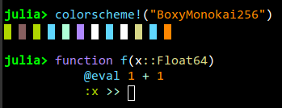

# Syntax highlighting


Highlighting of keyword, operators, symbols, strings etc. in different colors.


# Default schemes

    * "JuliaDefault" - the default Julia scheme.
    * "Monokai16" - 16 colors
    * "Monokai256" - 256 colors
    * "BoxyMonokai256" - 256 colors

 By default, "Monokai16" will be used on Windows and "Monokai256" otherwise. To test the supported colors in your terminal you can use `OhMyREPL.ANSICodes.test_ANSI()` and `OhMyREPL.ANSICodes.test_ANSI_256()` to test 16 and 256 colors respectively.

# Preview

To see an example output of a colorscheme use `test_colorscheme(name::String)`.


# Activate

To activate a colorscheme use `colorscheme!(name::String)`



* Syntax highlighting -

## Creating your own colorschemes.

!!! info
    Please refer to the [ANSIToken](@ref) section while reading this section.

    * `symbol!`
    * `comment!`
    * `string!`
    * `call!`
    * `op!`
    * `keyword!`
    * `text!`
    * `function_def!`
    * `error!`
    * `argdef!`
    * `macro!`
    * `number!`

```jl
import OhMyREPL.Passes.SyntaxHighlighter
import SyntaxHighlighter: ColorScheme, SYNTAX_HIGHLIGHTER_SETTINGS, add!
import OhMyREPL.ANSICodes.ANSIToken

function rand_token()
    ANSIToken(background = rand(1:256), foreground = rand(1:256),
              bold = rand(Bool), italics = rand(Bool), underline = rand(Bool))
end

function create_random_colorscheme()
    random = ColorScheme()
    SyntaxHighlighter.symbol!(random,rand_token())
    SyntaxHighlighter.comment!(random, rand_token())
    SyntaxHighlighter.string!(random, rand_token())
    SyntaxHighlighter.call!(random, rand_token())
    SyntaxHighlighter.op!(random, rand_token())
    SyntaxHighlighter.keyword!(random, rand_token())
    SyntaxHighlighter.macro!(random, rand_token())
    SyntaxHighlighter.function_def!(random, rand_token())
    SyntaxHighlighter.text!(random, rand_token())
    SyntaxHighlighter.error!(random, rand_token())
    SyntaxHighlighter.argdef!(random, rand_token())
    SyntaxHighlighter.number!(random, rand_token())
    return random
end

test_colorscheme(create_random_colorscheme())
```

Test the look

```
test_colorscheme(strange)

add!(SYNTAX_HIGHLIGHTER_SETTINGS, "Strange", _create_strange_colorscheme())
```