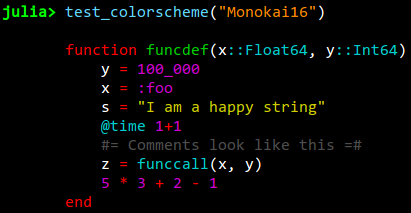
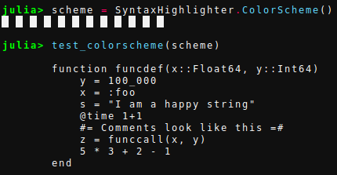
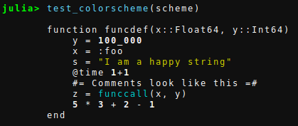
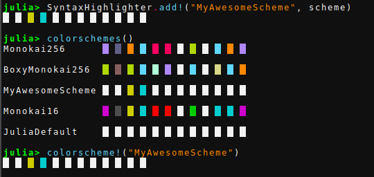
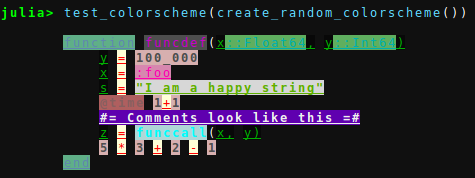

# Syntax highlighting


The Syntax highlighting pass transforms input text in the REPL to highlighted text, highlighting keyword, operators, symbols, strings etc. in different colors. There are a few color schemes that comes with `OhMyREPL` but it is fairly easy to create your own to your liking.

## Default schemes

The current default colorschemes that comes with `OhMyREPL` are

* "JuliaDefault" - the default Julia scheme, white and bold.
* "Monokai16" - 16 color Monokai
* "Monokai256" - 256 colors Monokai
* "BoxyMonokai256" - 256 colors Monokai from [here](https://github.com/oivva/st-boxy)

 By default, "Monokai16" will be used on Windows and "Monokai256" otherwise. To test the supported colors in your terminal you can use `OhMyREPL.ANSICodes.test_ANSI()` and `OhMyREPL.ANSICodes.test_ANSI_256()` to test 16 and 256 colors respectively.

## Preview

To see an example output of a colorscheme use `test_colorscheme(name::String, [test_string::String])`. If a `test_string` is not given, a default string will be used.



## Activate

To activate a colorscheme use `colorscheme!(name::String)`


## Creating your own colorschemes.

This section will describe how to create your own colorscheme.

!!! info
    Please refer to the [ANSIToken](@ref) section while reading this section.

We start by importing the `SyntaxHighlighter` module and the `ANSIToken` type.

```
import OhMyREPL: Passes.SyntaxHighlighter, ANSICodes.ANSIToken
```

We now create a default colorscheme:

```
scheme = SyntaxHighlighter.ColorScheme()
```

By using the function `test_colorscheme` we can see that the default colorscheme simply prints everything in the default color:



There are a number of setter function that updates the colorscheme. They are called like `setter!(cs::ColorScheme, token::ANSIToken)`. The different setters are:

* `symbol!` - A symbol, ex `:symbol`
* `comment!` - A comment, ex `# comment`, `#= block comment =#`
* `string!` - A string or char, ex `"""string"""`, `'a'`
* `call!` - A functionc all, ex `foo()`
* `op!` - An operator, ex `*`, `√`
* `keyword!` - A keyword, ex `function`, `begin`, `try`
* `function_def!` - A function definition, ex `function foo(x) x end`
* `error!` - An error in the Tokenizer, ex `#= unending multi comment`
* `argdef!` - Definition of a type, ex `::Float64`
* `macro!` - A macro, ex `@time`
* `number!` - A number, ex `100`, `100_00.0`, `0xf00`
* `text!` - Nothing of the above

Let us set the strings to be printed in yellow, numbers to be printed in bold, and function calls to be printed in cyan:

```
SyntaxHighlighter.string!(scheme, ANSIToken(foreground = :yellow))
SyntaxHighlighter.number!(scheme, ANSIToken(bold = true))
SyntaxHighlighter.call!(scheme, ANSIToken(foreground = :cyan))
```

!!! info
    Remember that you can also use integers for the `foreground` and `background` arguments to `ANSIToken` and they will then refer to the colors showed by `OhMyREPL.ANSICodes.test_ANSI_256()`. You can of course also specify many properties for the same `ANSIToken`.

By recalling `test_colorscheme` on the scheme we can see it has been updated:



By continuing in this fashion you can build up a full colorscheme. When you are satisfied with your colorscheme you can add it to the group of color schemes and activate it as:



You can look in the source code to see how the default color schemes are made.

For fun, the code below creates a truly random colorscheme:

```jl
function rand_token()
    ANSIToken(background = rand(1:256), foreground = rand(1:256),
              bold = rand(Bool), italics = rand(Bool), underline = rand(Bool))
end

function create_random_colorscheme()
    random = SyntaxHighlighter.ColorScheme()
    SyntaxHighlighter.symbol!(random,rand_token())
    SyntaxHighlighter.comment!(random, rand_token())
    SyntaxHighlighter.string!(random, rand_token())
    SyntaxHighlighter.call!(random, rand_token())
    SyntaxHighlighter.op!(random, rand_token())
    SyntaxHighlighter.keyword!(random, rand_token())
    SyntaxHighlighter.macro!(random, rand_token())
    SyntaxHighlighter.function_def!(random, rand_token())
    SyntaxHighlighter.text!(random, rand_token())
    SyntaxHighlighter.error!(random, rand_token())
    SyntaxHighlighter.argdef!(random, rand_token())
    SyntaxHighlighter.number!(random, rand_token())
    return random
end

test_colorscheme(create_random_colorscheme())
```



